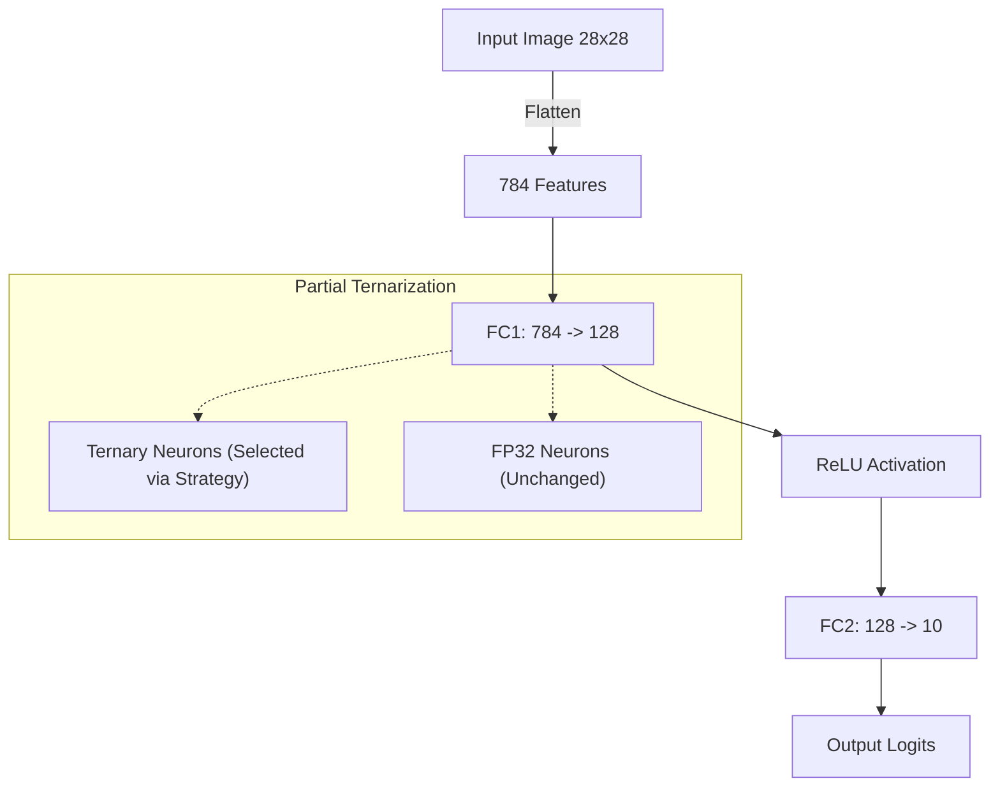
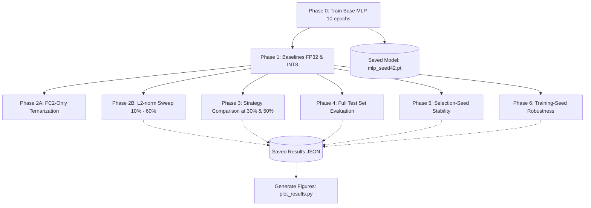

# Entropy-Guided Partial Ternarization for Hybrid-Precision Neural Inference

Reproducibility codebase for the paper:

> **Entropy-Guided Partial Ternarization for Hybrid-Precision Neural Inference**  
> Abhishek Yadav, Melwin Antony, C. Indira Devi  
> Garden City University, Bengaluru

---

> [!WARNING]
> **Dataset and Generalization Warning**
> This codebase and its findings have only been tested on the **MNIST** dataset using a simple two-layer MLP (784-128-10). The effectiveness of entropy-guided ternarization has not been validated on more complex datasets (e.g., CIFAR-10, ImageNet) or deeper architectures (e.g., ResNets, Transformers). Results may vary significantly when applied to other domains.

## Overview

This project implements and evaluates three neuron-selection strategies for post-training partial ternarization of a two-layer MLP on MNIST:

| Strategy | Deterministic | Notes |
|---|---|---|
| **Entropy-guided** | Yes (sigma = 0) | Selects neurons by ascending ternary entropy |
| **L2-norm** | Yes (sigma = 0) | Selects neurons by ascending weight norm |
| **Random** | No (sigma ~ 4%) | Uniform random subset |

**Key finding:** Entropy-guided selection achieves 42.35% operation-count reduction at 50% ternarization with 91.80% accuracy (vs FP32 97.75%), with **zero seed variance** — making it reproducible by construction.

---

## Architecture

The base model is a standard two-layer Multi-Layer Perceptron (MLP). Partial ternarization is applied selectively to the hidden neurons (FC1).



---

## Theory

**What is Partial Ternarization?**
Ternarization usually quantizes neural network weights into three discrete values (e.g., `-1, 0, 1`). This reduces memory footprint and computational complexity. In this project, we explore **partial ternarization**, where only a fraction of the neurons in a layer are ternarized, while the rest remain in full precision (FP32). This creates a hybrid-precision layer that balances computational efficiency and model accuracy.

**Selection Strategies:**
The core question is *which* neurons to ternarize. We evaluate:
- **Random:** A naive baseline that picks neurons randomly.
- **L2-norm:** Picks neurons with the smallest weight magnitudes.
- **Entropy-guided:** Our novel approach. It calculates the Shannon entropy of the ternary symbol distribution for each neuron row and selects those with the lowest entropy (i.e., highly skewed distributions).

**Ternarization Formula:**
For a selected neuron weight row **W**:
```text
wt = +1   if w >  τ · max|W|
wt = −1   if w < −τ · max|W|
wt =  0   otherwise

τ = 0.3 (threshold)

weff = wt · pnz   where pnz = clip(|w| / max|W|, 0.1, 0.9)
weff = 0          when wt = 0
```
*Note: This specific hybrid formulation retains per-element continuous magnitude information (`pnz`), differentiating it from standard discrete TWN (Ternary Weight Networks).*

---

## Project Structure & Files

- `src/model.py`: Defines the `MLP` class (784-128-10 architecture).
- `src/train.py`: Contains standard PyTorch training and evaluation loops for MNIST.
- `src/ternarize.py`: The core logic. Contains functions for ternarizing weight rows, calculating operation-count proxies, simulating INT8, and implementing the three selection strategies (`select_random`, `select_l2_norm`, `select_entropy_guided`).
- `pipeline.py`: The main execution script. Orchestrates the training and the 6 experimental phases, saving outputs to JSON files.
- `plot_results.py`: Reads the generated JSON files and plots them using matplotlib.
- `tests/test_ternarize.py`: Comprehensive test suite verifying logic, matrix shapes, operations, and strict determinism of the entropy-guided strategy.

---

## Workflow

The experimental pipeline runs sequentially through several phases to evaluate the compression techniques.



---

## Setup & Usage

### Setup
```bash
git clone <your-repo-url>
cd entropy-ternary
pip install -r requirements.txt
```

### Run the full pipeline
```bash
python pipeline.py
```
This will train the model, run all evaluations, and save the results in `outputs/results/`.

### Generate figures
```bash
python plot_results.py
```
Produces `fig1_l2_sweep.png`, `fig2_strategy_comparison.png`, and `fig3_seed_stability.png` in `outputs/figures/`.

### Run tests
```bash
pytest tests/ -v
```

---

## Results (Full Test Set, 10,000 samples)

Results are generated by running `python pipeline.py` and saved to `outputs/results/`.

Reference numbers from a reproducibility run (seed=42, 10 epochs, PyTorch 2.12, CPU):

| Method | Accuracy (%) | Drop (%) | OpRed (%) |
|---|---|---|---|
| FP32 | 97.75 | 0.00 | 0.00 |
| INT8 (simulated) | 97.73 | 0.02 | 0.00 |
| Random 50% | 89.86 | 7.89 | 38.49 |
| **Entropy-guided 50%** | 91.80 | 5.95 | 42.35 |
| L2-norm 50% | 60.44 | 37.31 | 35.90 |

Random 50% (20 seeds): mean = 88.81%, sigma = 4.13%, range [80.60%, 94.56%]

> **Note:** Exact numbers may vary slightly across PyTorch versions and hardware. Run the pipeline to generate your own results.

---

## Reproducibility Notes

- All experiments use `torch.manual_seed`, `numpy.random.seed`, and `random.seed` explicitly.
- The same trained checkpoint is reused for all strategy comparisons in a given run.
- Entropy-guided and L2-norm selections are **fully deterministic** under fixed weights — no seed needed.
- Random selection variance is evaluated across 20 independent seeds.
- Final reporting uses the **full 10,000-sample MNIST test set** as primary standard.

---

## Citation

```bibtex
@article{yadav2025entropy,
  title   = {Entropy-Guided Partial Ternarization for Hybrid-Precision Neural Inference},
  author  = {Abhishek Yadav},
  year    = {2025},
  journal = {Student Research}
}
```

---

## Acknowledgements
Bengaluru · PyTorch open-source community
